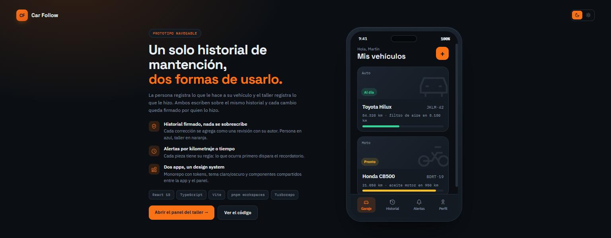
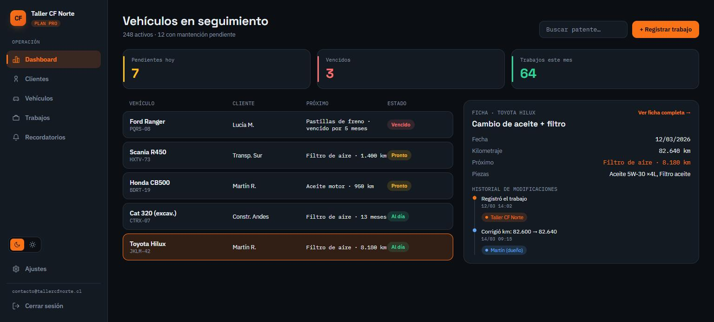
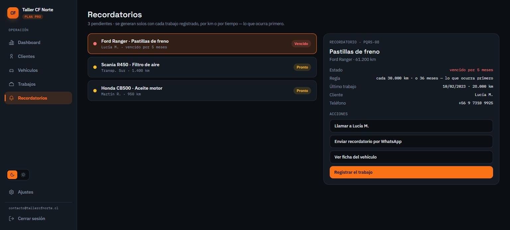
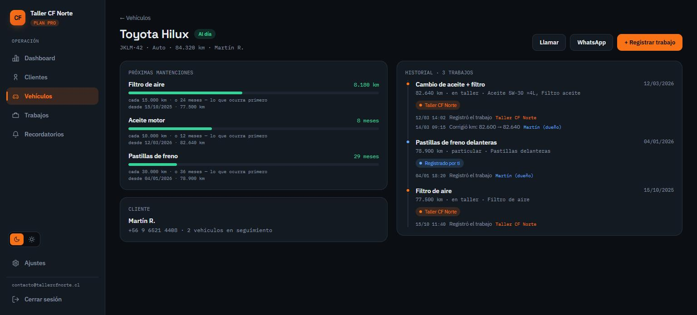
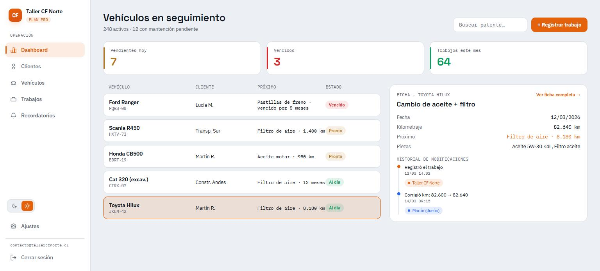

<div align="center">

# Car Follow

**El historial de mantención de tu vehículo, compartido entre quien lo maneja y quien lo repara.**

[](https://react.dev)
[](https://www.typescriptlang.org)
[](https://vite.dev)
[](https://pnpm.io)
[](https://turbo.build)



</div>

## El problema

El historial de mantención de un vehículo vive partido en dos: lo que el taller anotó
en su sistema y lo que el dueño recuerda. Cuando el auto cambia de manos, o de taller,
esa información se pierde.

**Car Follow** es un solo historial con dos formas de escribir en él: una app móvil para
la persona y un panel web para el taller. Cada cambio queda **firmado por su autor** y
nada se sobrescribe — si el taller anota 82.600 km y el dueño lo corrige a 82.640, quedan
las dos entradas con su firma y su hora.

## Qué demuestra este proyecto

| | |
|---|---|
| **Nada de estado duplicado** | Los recordatorios, la barra de progreso y el estado de cada vehículo **no se guardan**: se derivan del último trabajo que cubrió cada pieza más su regla por km/meses. Registrar una mantención mueve el recordatorio solo, sin sincronizar dos fuentes de verdad. |
| **Monorepo real** | pnpm workspaces + Turborepo: dos apps y tres packages compartidos, con un contrato de tipos único (`@cf/types`) pensado para que el backend futuro lo reutilice. |
| **Design system propio** | Tokens de color en CSS custom properties, tema claro/oscuro persistido, y componentes compartidos entre ambas apps (`@cf/ui`). |
| **Audit trail en el modelo** | El historial es append-only por diseño: cada `Revision` guarda autor, descripción y timestamp. La propiedad se sostiene desde el tipo, no desde la UI. |
| **Criterio, no abstracción** | El repo sigue reglas de decisión explícitas: regla de tres, prohibido el parámetro-bandera, sin indirección de un solo uso. `formatDate` está duplicada a propósito porque son dos formatos distintos, no una función con un flag. |
| **Arquitectura pensada** | El plan de backend, el modelo de autenticación y las decisiones de seguridad están razonados abajo, incluyendo por qué **no** se usa Next.js acá. |

> **Estado:** prototipo navegable con datos en memoria. No hay backend, persistencia ni
> tests todavía — el plan del backend está más abajo y aún no existe en código.

### Cómo se derivan los recordatorios

Cada pieza tiene una regla (`cada 10.000 km · o 12 meses`). Para cada vehículo se busca
el trabajo más reciente que la cubrió y se calcula cuánto del intervalo se consumió por
kilometraje y por tiempo. **Gana el eje que va más adelante** — el que dispara primero:

```ts
const byKm   = (vehicle.odometer - last.odometer) / rule.intervalKm;
const byTime = monthsSince(last.date) / rule.intervalMonths;
const progress = Math.max(byKm, byTime);   // >= 0.8 → "pronto", >= 1 → "vencido"
```

El estado del vehículo es el peor de sus piezas. Una pieza sin ningún trabajo registrado
no genera recordatorio: no hay desde dónde contar el intervalo. Todo esto vive en
`packages/mock-data/src/index.ts` y se muda al backend tal cual cuando exista.

### Sesión, roles y guardas de ruta

**El rol no se elige al entrar: se descubre.** El login pide solo correo y contraseña,
busca la cuenta en el directorio y lee su `role`. Si esa cuenta pertenece a la otra app,
te redirige a ella. El tipo de cuenta se elige **una sola vez, en `/registro`**.

```ts
const cuenta = accountByEmail(email);
if (!cuenta)                    → "No hay ninguna cuenta con ese correo."
if (cuenta.role !== "taller")   → redirige a la app de la persona
else                            → entra
```

Esto importa más allá del formulario: un cliente que elige su propio rol es un cliente
que se auto-asigna permisos. El rol es un dato de la cuenta que resuelve el servidor.

Sin sesión ninguna pantalla se monta — te manda a `/login` recordando a dónde ibas, y al
entrar vuelves ahí. La sesión vive en `sessionStorage`, no en `localStorage`, que es lo
mismo que hará el JWT cuando exista.

| Cuenta de prueba | Rol |
|---|---|
| `martin@correo.cl` | persona |
| `lucia@correo.cl` | persona |
| `contacto@tallercfnorte.cl` | taller |

> ⚠️ **Nada de esto es seguridad.** El directorio de cuentas es un array en el cliente y
> la contraseña no se valida ni se guarda: no hay servidor contra el cual validarla, y
> hashearla en el navegador no protegería nada. Las guardas de ruta son de experiencia
> de usuario — un cliente siempre se las puede saltar. La autorización real tiene que
> vivir en cada endpoint del backend, y está diseñada abajo.
>
> Las cuentas creadas en `/registro` quedan en el `localStorage` de ese origen. Sin
> servidor no hay forma de compartirlas entre `app.` y `taller.carfollow.io`: por eso
> elegir el tipo "del otro lado" te lleva a registrarte allá.

## Las dos apps

### Panel del taller

Dashboard ordenado por urgencia, con búsqueda y ficha de auditoría que muestra quién
tocó qué y cuándo. La columna **Próximo** y el estado de cada fila salen del cálculo,
no de datos guardados.



Los recordatorios se seleccionan y abren un panel con las acciones sobre el cliente —
llamar, mandar el aviso por WhatsApp con el mensaje ya redactado, o saltar directo a
registrar el trabajo con el vehículo preseleccionado:



Cada vehículo tiene su ficha en `/vehiculos/:id`, con las próximas mantenciones, el
historial completo y el audit trail de cada corrección:



Tema claro incluido, con la misma paleta portada a valores accesibles:



### App de la persona

Garaje, detalle del vehículo con su historial, registro de mantenciones, reglas por
pieza y alertas derivadas de las mismas reglas que usa el taller. En pantalla grande se
muestra dentro de un dispositivo; en móvil el marco desaparece y la app ocupa toda la
ventana.

## Correr el proyecto

Requiere **Node 20+** y **pnpm 10+**.

```bash
pnpm install
pnpm dev          # ambas apps a la vez
```

| App | URL | Script individual |
|---|---|---|
| Persona (móvil) | http://localhost:5173 | `pnpm dev:persona` |
| Taller (web) | http://localhost:5174 | `pnpm dev:taller` |

Otros scripts: `pnpm build`, `pnpm typecheck`.

> `pnpm lint` hoy ejecuta `tsc --noEmit`, igual que `typecheck`. No hay ESLint configurado
> todavía y el README no va a decir lo contrario.

## Estructura

```
apps/
  persona/     App de la persona (React + Vite, móvil). Garaje, detalle+historial,
               registrar mantención, reglas por pieza, alertas.
  taller/      Panel del taller (React + Vite, web). Dashboard con KPIs, tabla de
               vehículos, ficha con auditoría, clientes, trabajos, recordatorios.
packages/
  ui/          Design system CF: tokens de color, ThemeProvider (claro/oscuro),
               componentes compartidos (Logo, StatusBadge, ProgressBar, AuthorPill…).
  types/       Tipos/DTOs compartidos (Vehicle, MaintenanceRecord, PartRule…).
  mock-data/   Datos de ejemplo derivados del diseño.
project/       Diseño original exportado desde Claude Design (referencia).
chats/         Transcripción de la conversación de diseño (referencia).
```

Los datos viven en React state y se reinician al recargar.

---

<details>
<summary><strong>Plan de backend</strong> — monolito modular NestJS + PostgreSQL + Prisma</summary>
<br />

Arquitectura pensada para el alcance actual, sin microservicios:

- **Monolito modular** con **NestJS + PostgreSQL + Prisma**, organizado por módulos:
  `auth`, `vehicles`, `maintenance`, `reminders`, `workshops` y `billing`.
- **Suscripción mensual/anual** para **talleres y personas** (freemium: hay un plan
  gratuito, el pago desbloquea límites/funciones). El módulo `billing` queda
  modelado en la base de datos desde ya (planes, estado de suscripción, fechas de
  ciclo) pero **sin integrar Stripe todavía** — se conecta cuando haya clientes
  reales pagando. Mientras tanto todo el mundo corre en el plan gratuito.
- `packages/types` ya define los DTOs para que frontend y backend compartan contrato.

Los módulos de NestJS dejan el corte listo por si algún día conviene separar alguna
pieza en su propio servicio.

### Autenticación

- **Email + contraseña** con JWT (access + refresh token). Dos roles: `persona` y
  `taller` — un mismo usuario de taller puede tener varios miembros de staff a
  futuro, pero para el alcance actual alcanza con un rol simple por cuenta.
- Vive en el módulo `auth` del monolito Nest; ambos frontends (persona y taller)
  consumen la misma API de auth.
- OAuth (Google) o magic link quedan abiertos para una iteración futura si hace
  falta reducir fricción de registro — no bloquean nada de lo de abajo.

</details>

<details>
<summary><strong>Seguridad</strong> — JWT, IDOR, hashing de contraseñas, inyección SQL</summary>
<br />

- **Credenciales nunca en el frontend**: el frontend no guarda contraseñas, API
  keys ni secretos — solo el JWT del usuario logueado, en memoria/`sessionStorage`
  (no `localStorage`, para reducir exposición a XSS). Toda variable sensible
  (secreto de firma JWT, credenciales de Postgres, claves de Stripe) vive en
  variables de entorno del backend / Docker secrets, nunca en el bundle del
  cliente ni comiteada al repo (`.env` en `.gitignore`, `.env.example` como
  plantilla).

- **Guard de propiedad en cada endpoint** (no solo autenticación, sino
  autorización): además del `AuthGuard` que valida el JWT, cada endpoint que
  toca un recurso (vehículo, mantención, cliente) lleva un guard que confirma
  que el `sub` (id de usuario) del token es dueño de ese recurso — o, en el caso
  del taller, que el vehículo/cliente pertenece a ese taller. Esto evita **IDOR**
  (que el usuario A cambie `/vehiculos/123` con el token de A pero el vehículo
  123 sea de B con solo adivinar el id). Se implementa como un `ResourceOwnerGuard`
  reusable en Nest, más un `RolesGuard` aparte para separar rutas exclusivas de
  `persona` vs `taller`.

- **JWT — qué va en el payload y cuánto dura**: un JWT está *firmado*, no
  *cifrado* — cualquiera puede decodificar el payload (es base64), solo no puede
  falsificarlo sin la clave. Por eso el payload lleva lo mínimo: `sub` (id de
  usuario), `role`, `exp` — nunca contraseña, ni email, ni datos sensibles.
  Firmado con secreto fuerte (o RS256 asimétrico si el token debe validarse desde
  varios servicios). Sobre expiración: un **access token corto** (recomendado
  15–60 min) + **refresh token** más largo (7–30 días, rotable y revocable en
  Redis/DB) es más seguro que un token único de larga duración, porque si el
  access token se filtra, la ventana de abuso es corta. Si se prefiere simplicidad
  para el MVP, un solo token de **12 h** es una opción razonable mientras no haya
  refresh implementado — quedaría como configuración (`JWT_EXPIRES_IN`) fácil de
  ajustar después sin tocar código.

- **Hash de contraseñas — por qué NO SHA-256**: SHA-256 es un hash de propósito
  general diseñado para ser *rápido*, y esa es exactamente la propiedad que no
  se quiere acá. Una GPU moderna calcula del orden de **10¹⁰ SHA-256 por
  segundo**, así que ante una filtración de la base de datos un diccionario
  revienta las contraseñas comunes en minutos. Tampoco lleva sal por sí solo:
  dos usuarios con la misma contraseña quedan con el mismo hash, y las rainbow
  tables hacen el resto.

  Lo correcto es un **KDF lento, salado y con costo configurable**. En orden de
  preferencia:

  | Algoritmo | Cuándo | Parámetros de partida |
  |---|---|---|
  | **Argon2id** ✅ | Elección por defecto — ganador del Password Hashing Competition, resistente a GPU y ASIC porque además de tiempo exige memoria | `m=19 MiB, t=2, p=1` (mínimo OWASP) |
  | **scrypt** | Alternativa si Argon2 no está disponible en el runtime | `N=2^17, r=8, p=1` |
  | **bcrypt** | Opción más probada y con más años de rodaje; tope de 72 bytes de entrada | `cost ≥ 12` |

  En Node: `argon2` (binding nativo) o `node:crypto.scrypt`. El hash **siempre se
  calcula en el servidor**: hacerlo en el navegador no protege nada — el hash
  pasa a *ser* la contraseña (quien lo intercepte se autentica con él) y de todas
  formas viaja por la red. El cliente manda la contraseña por HTTPS y el servidor
  la hashea.

  Además: throttling de intentos de login (`@nestjs/throttler`) para frenar
  fuerza bruta, y no revelar en el error si fue el email o la contraseña la que
  falló.

- **Inyección SQL en los endpoints de usuario**: **Prisma** parametriza las
  queries por diseño, así que el ORM ya evita la inyección clásica mientras no se
  usen `$queryRawUnsafe` / concatenación de strings (se prohíbe explícitamente en
  code review). Además, todo input de entrada pasa por **DTOs con
  `class-validator`** y el `ValidationPipe` global de Nest en modo
  `whitelist: true, forbidNonWhitelisted: true` — cualquier campo no declarado en
  el DTO se descarta antes de llegar a la capa de datos, así que ni siquiera hay
  superficie para intentarlo desde los campos de perfil, vehículos, etc.

- **TLS / HTTPS — es infraestructura, no código**: no se "agrega" a la app; se
  termina en el reverse proxy. **Traefik** delante de todo con certificados
  automáticos de **Let's Encrypt** (renovación sola cada 90 días), redirección
  `301` de `:80` a `:443`, TLS 1.2+ y **HSTS** (`Strict-Transport-Security`, vía
  `helmet`) para que el navegador ni intente HTTP después de la primera visita.
  Las cookies —si en algún momento se usan en vez del header `Authorization`—
  van `Secure`, `HttpOnly` y `SameSite=Lax`. En desarrollo local se sigue
  trabajando sobre HTTP: el certificado se emite recién cuando hay un dominio
  real apuntando al VPS.

- **Otros mínimos de higiene** que quedan incluidos en el mismo esfuerzo: CORS
  restringido a los subdominios propios (`app.` / `taller.carfollow.io`), cabeceras
  de seguridad con `helmet`, y el historial de auditoría (quién firmó cada cambio)
  que ya es parte del modelo de datos y sirve también como rastro de seguridad.

</details>

<details>
<summary><strong>Despliegue y ADRs</strong> — Docker en VPS, Traefik, y por qué no Next.js</summary>
<br />

### Docker en un VPS propio

- **Empaquetado**: cada pieza en su contenedor (`Dockerfile` multi-stage: build con
  pnpm → imagen final mínima). Las apps de Vite compilan a estático y se sirven con
  Nginx; Nest corre como proceso Node.
- **Orquestación**: `docker-compose.yml` con `persona`, `taller`, `api`, `worker`
  (jobs de recordatorios), `postgres`, `redis`.
- **Host**: un VPS (Hetzner / DigitalOcean tipo) corriendo `docker compose`. Simple
  y barato para arrancar; con las imágenes ya hechas, migrar después a algo
  gestionado (Fly.io, ECS, Kubernetes) es un paso de infraestructura, no de código.
- **Reverse proxy + HTTPS**: **Traefik** delante de todo, certificados automáticos
  vía Let's Encrypt.
- **Dominios**: subdominios separados —
  - `app.carfollow.io` → app de la persona
  - `taller.carfollow.io` → panel del taller
  - `api.carfollow.io` → API de Nest
- **CI/CD**: GitHub Actions build de las imágenes en cada push a `main` → deploy por
  SSH al VPS (`docker compose pull && docker compose up -d`).
- **Escalar con el tiempo**: los frontends ya son estáticos (CDN-friendly, escalan
  solos); si crece la carga, se replica `api` detrás de Traefik (stateless) y se
  atiende el cuello de botella real, que normalmente es la base de datos (réplicas
  de lectura / pooling de conexiones) y las notificaciones (worker separado).

### ADRs

- **Vite (SPA) en vez de Next.js**: hay un backend Nest dedicado, ambas apps están
  detrás de login (sin necesidad de SSR/SEO), y la app de la persona apunta a móvil
  a futuro (Capacitor/React Native) — Next añadiría un segundo tier de servidor sin
  aportar nada en este caso. Si más adelante se necesita una landing pública
  indexable, esa sí se construiría con Next como proyecto aparte (`apps/web`).
- **Docker + VPS propio en vez de plataforma gestionada**: para el tamaño actual del
  proyecto, un VPS con `docker-compose` es más barato y da control total, sin atarse
  a un proveedor. Las imágenes Docker hacen la migración a un servicio gestionado
  trivial si el crecimiento lo justifica más adelante.

</details>
